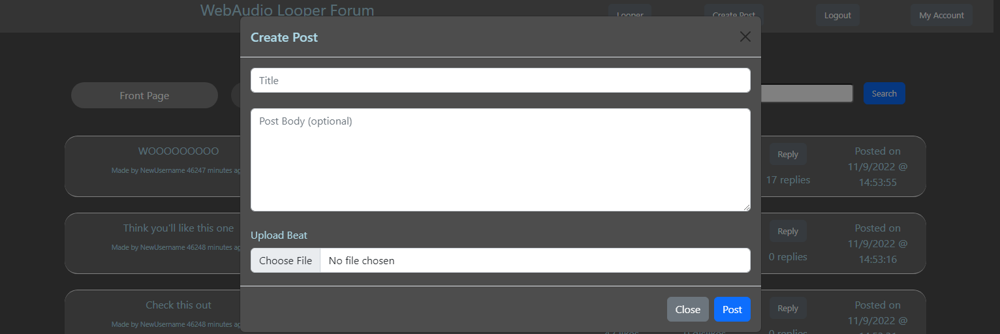

# Team Mu
## Web-Looper
Fall 2022

## Team Members
- Hyuk-Je Kwon - Github: hyukjekwon
- Austin Bushey - Github: Bushey27
- Guy Michaely - Github: GuyMichaely

## User Interface:

This is the basic forum UI for a logged in user.


This is the basic forum UI for an anonymous user.


This is the UI for viewing a post.


This is the UI for replying to a post.


This is the UI for creating a post.


This is the UI for the web-looper component.


This is the UI for the login page.


This is the UI for the account registration page.


This is the UI for the My Account page.

## APIs
- /frontpage - shows the 10 most liked posts over the last day
- /newest - shows the 10 most recent posts
- /latestReplies - shows the 10 posts with the most recent replies
/yourPosts - shows your posts
- /posts
    - /getPosts - returns the list of posts that frontpage, newest, latestreplies, and yourposts shows
    - /searchposts - returns the list of posts that contain the searched phrase
    - /getAudioFile - gets an audio file based on the post ID

## URL Routes/Mapping

- / - serves the forum page to the user and calls /frontpage
- /posts
    - /createPost - upload a loop file and creates a post with either the username if the user is logged in or with “Anonymous” as the name
    - /likepost - likes a post, allows anonymous likes
    - /dislikepost - dislikes a post, allows anonymous dislikes
    - /reply - replies to a post with either the username if the user is logged in or with “Anonymous” as the name
    - /delete - deletes a post based on the post ID, the post must belong to the logged in user and anonymous users can not delete posts
- /register - serves the register page to the user
- /login - servers the login page to the user
- /userregister - creates username password pair on db, notify if username already exists
- /userlogin - return a session cookie? Allowing holder of cookie to change data for the logged in user
- /logout - logs the user out and redirects to ‘/’
- /account - serves the account page for the logged in user an displays account info, only logged in users can access
- /looper - serves the login page to the user

## Database Layout
### Posts Table:
Column | Type | Description
 --- | --- | --- 
postid | bigint | Stores a unique postID for a post.
username | text | Stores the username associated with a post.
time | text | Stores a string that represents when the post was created.
title | text | Stores the title of a post, defined by the user.
body | text | Stores the body of a post, can be empty.
likes | integer | Stores the amount of likes that a post has.
dislikes | integer | Stores the amount of dislikes that a post has.

### Users Table:
Column | Type | Description
 --- | --- | --- 
username | text | String username.
salt | text | The user specific salt prepended to the supplied password.
hash | text | Hash of salt + password.

### Session Table:
Column | Type | Description
 --- | --- | --- 
sid | text | Session ID.
sess | json | Session data.
expire | timestamp | How long the session lasts before it expires.

### FileDataBase Table:
Column | Type | Description
 --- | --- | --- 
postid | bigint | Unique post ID for a specific post file.
postfile | text | Stores the base 64 data for a post’s associated audio file.

## Authentication/Authorization
Auth is done via session tokens. First, a user registers an account, which adds a row in a table with a ```(username, salt, hash)``` tuple. When they login in the future, their credentials are checked against the salt and hash info to authenticate. If they provided the correct info, a session cookie is created and a corresponding session is stored in the ```session``` table, so that in future page navigation the user doesn’t have to reprovide their login credentials. When a user chooses to log out, their database session is destroyed.
When a user is not logged in, they are shown the default UI view of the forum. When they are logged in, they are shown a modified view of the forum page with buttons pertaining to actions a logged in user can make (i.e. Logout, My Account). Also a logged in user can filter posts to see only they created which is functionality not available to users that are not logged in.

## Division of Labor
Austin - Handled everything post related with the forum. This includes:
- Database implementation of posts and  filedatabase
- Frontend implementation of post-related components, includes:
    - Basic forum UI - Includes how each post is generated in HTML
    - View post UI - Includes how each post is generated in HTML and audio controls
    - Create post UI and create reply UI
- backend implementation of post-related components, includes:
    - creating a post/reply
    - liking, disliking
    - Deleting posts
    - Getting posts for server and database for /frontpage, /newest, /latestreplies, and /yourposts
    - Search button functionality
- Implemented all API endpoints for post(s) data

Guy - Handled everything with user authentication 
- Implementation of logging in, logging out, and account registration
    - Includes users database and backend
- Implementation of session information
    - Includes session database and backend
- Handled everything with authorization
    - Controlled how logged in users and anonymous users have their data represented in each post (Username)
    - Changed how the page is generated in accordance with session information and whether or not a user is logged in (Your posts button. login/logout buttons, my account and account registration buttons)

Hyuk-Je - Handled everything related to the looper, including:
- A dynamic interface that serves as a basic digital audio workstation with the following features:
    - Support for multiple layers of instruments
    - Note display for synths
- Actual digital audio workstation functionalities such as:
    - Playback
    - Toggleable metronome
    - Programmable intervals
    - Polyphonic synths
    - Speed/volume control
    - Exporting project as webm
- Also did some basic styling for the login and account registration pages.

# Conclusion: 
While we do feel like we've successfully produced a functioning product, there are a few things that became stumbling blocks along the way, some completely unexpected. For the looper, we were a little distraught by how sparse the documentation was, and couldn't find an established way of recording and encoding mp3 files from the browser. For playing the audio files in the forum, one thing that threw us for a loop was that file transmission wouldn't work unless we converted it to base64 text. Overall, the lesson seems to be that we underestimated just how difficult it was to leverage web audio to accomplish even the simplest of tasks.
