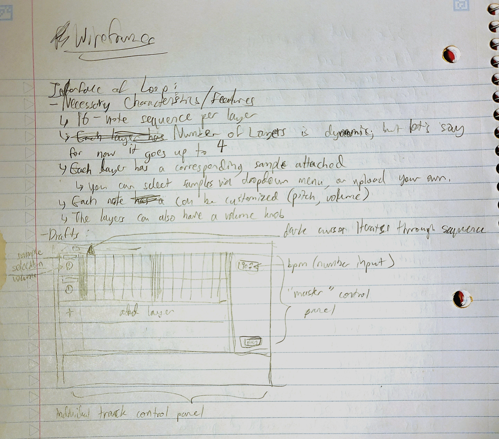
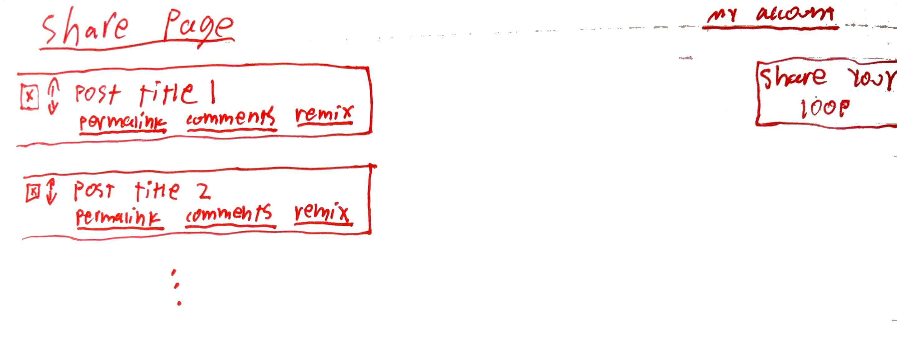
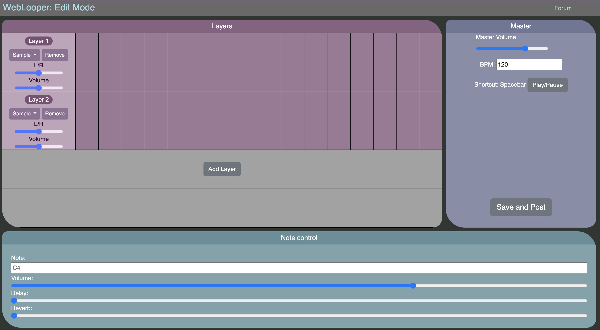
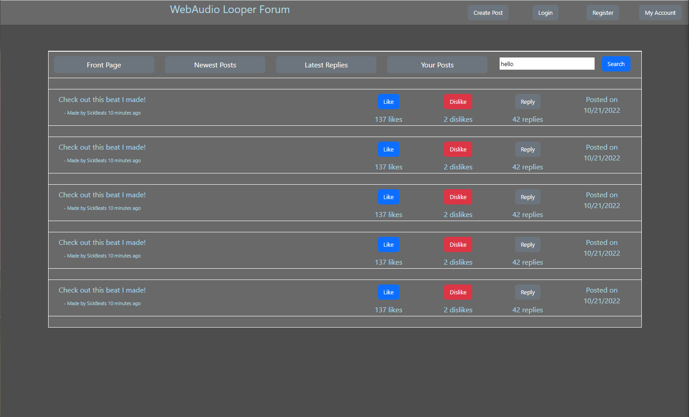

# Interactions Between Users and Data
Our project aims to create 1. A simple web application that allows users of any musical experience to compose short loops on the fly and 2. A forum that allows users to share their music projects with one another. The composition aspect of the website will include a loop over a sequence of notes, each with customizable attributes such as sample type, volume, pitch, delay, etc. This simple framework could allow the user to make drum loops, melodies, and harmonies. The forum aspect of the website will allow users to browse and rate and comment on other people's uploads. It will also allow users to load other people's uploads into their loop editor, so any sort of changes can be made to an existing project, allowing for a musical community that directly builds off of each other's ideas.
# Wireframes/Sketches
Looper wireframe:

Forum wireframe:

# Screenshots

# Division of Labor
Guy: Create forum wireframe  
Austin: Create forum HTML and CSS template.  
Hyuk-Je: Created looper wireframe and HTML/CSS template.