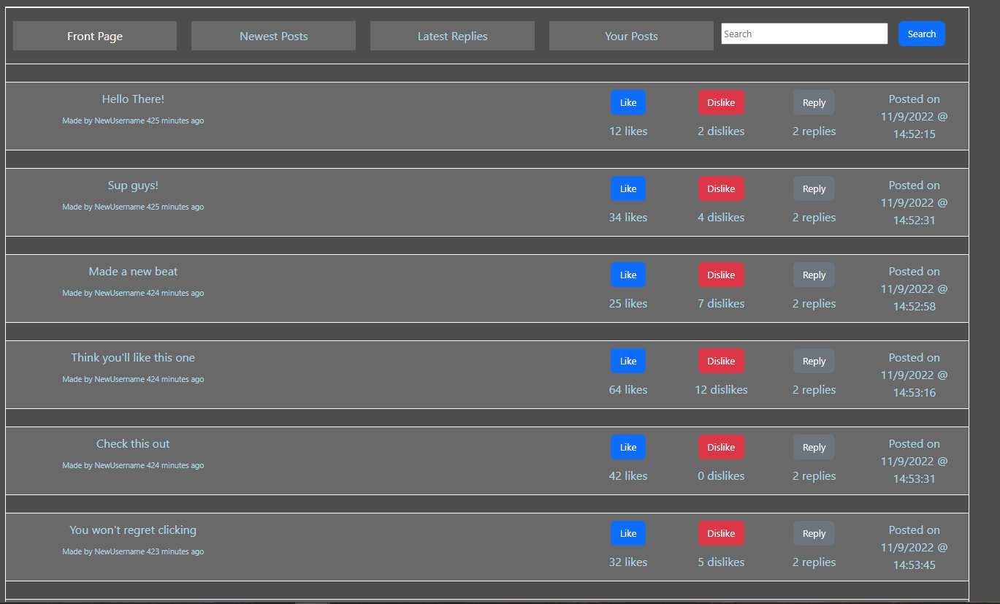

# Link to Hosted Website:
[WebAudio Looper Forum](https://web-looper.herokuapp.com/frontpage)

# APIs we used:

## Rest API

* /frontpage - shows the 10 most liked posts over the last day
* /newest - shows the 10 most recent posts
* /latestReplies - shows the 10 posts with the most recent replies
* /yourPosts - shows your posts
* /posts
    * /getPosts - returns the list of posts that frontpage and newest shows
    * /likepost - likes a post
    * /dislikes - dislikes a post
    * /reply - replies to a post
* /createPost - upload a loop file and creates a post
* /getAudioFile - gets an audio file based on the post ID in the HTTP POST 
    * /edit - edits a post based on the post ID in the HTTP POST 
    * /delete - deletes a post based on the post ID in the HTTP POST 
* /{postId} - get a looper forum post
* /account - return account page for logged in user with account info and posts belonging to account
* /objects/{id}
    * /addComment - add a comment to a post or comment given by an id. The id will be a hash or some kind of identifier for the object
* /createAccount - creates username password pair on db, notify if username already exists
* /login - return a session cookie? Allowing holder of cookie to change data for the logged in user

## CRUD - Create, Read, Update, Delete
### Create:

Posts can be created on the forum by a user.

### Read:

Posts can all be read in each tab and each tab in the forum represents a different array of posts that is generated based on the APIs described above.

### Update:

A post can be liked or disliked or replied to.

### Delete:

If it’s your post, it can be edited or deleted.

# Division of Labor:
* Austin: Worked on forum and server handling.
* Hyuk-Je: Worked on looper interface and functionality.
* Guy: Worked on forum and server handling.
